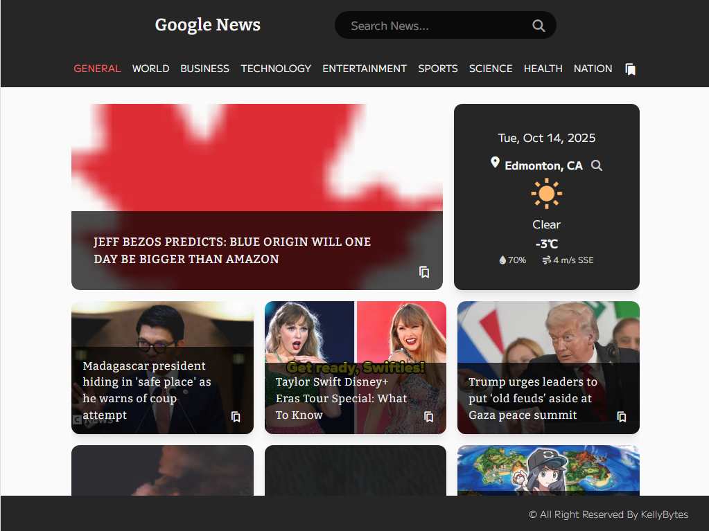
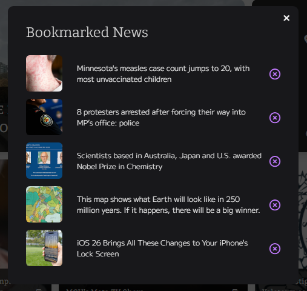
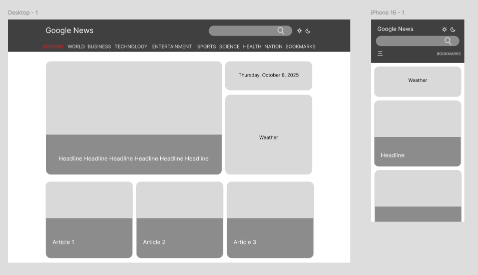

# News App

## Overview

A dashboard-style web application that displays the latest news and the current weather. It fetches top headlines and category-based articles from the GNews API. Users can bookmark their favorite articles to easily revisit them later.

### Features

- Read GNews Headlines and articles from chosen categories
- Search news with keywords
- Bookmark articles
- Check the current weather
- Responsive design

### Built with

- ReactJS
- Tailwind CSS
- GNews API
- OpenWeatherMap API

---

## Screenshots

**Desktop**

Dashboard

  

 

News modal and bookmarks

  
  

 

**Mobile**

  

 

**Wireframe**

  

