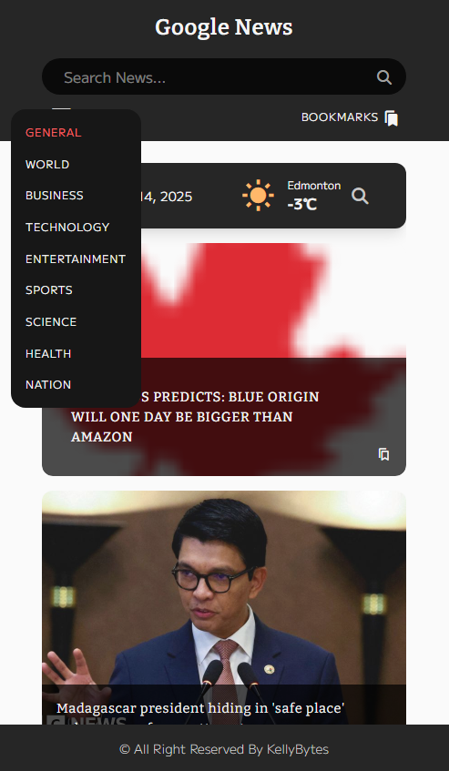

# News App [🔗](https://kb-news-app.netlify.app "Click to launch News App")

### Screenshots

---

## 💡 Overview

A **dashboard-style web application** that displays the latest news and current weather in a clean, responsive layout. It fetches top headlines and category-based articles from the **Google News API**, and weather data from the **OpenWeather API**. Users can **search**, **bookmark**, and **read** articles, as well as **check local weather** based on their current location or a city name.

 

## 🚀 Key Features

- Browse **top headlines** and category-specific articles
- **Search** news by keywords
- **Bookmark** articles for later reading
- **Check current weather** by city or user location
- **Fully responsive** design for all screen sizes

 

## 🧩 What I Learned

- Integrating **multiple APIs** (Google News & OpenWeather) within a single React app
- Handling **asynchronous data fetching** with error management
- Implementing **state management** and local storage for user bookmarks
- Improving **UI/UX accessibility** and responsive design
- Using **environment variables** for secure API key management

 

## 🛠 Skills Demonstrated

- **Frontend**:	React, JavaScript (ES6+), HTML5, CSS3
- **Styling**:	Tailwind CSS, Flexbox, Grid
- **APIs**:	Google News API, OpenWeather API
- **Version Control & Deployment**:	Git, GitHub, Netlify

 

## 🎯 Future Improvements

- Add user authentication for personalized bookmarks
- Display hourly or 7-day weather forecasts
- Implement dark mode for better accessibility

 

---

[🔼 Back to Top](#news-app-)
